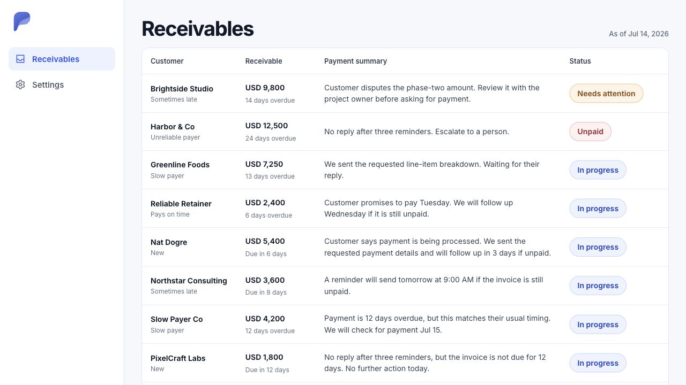
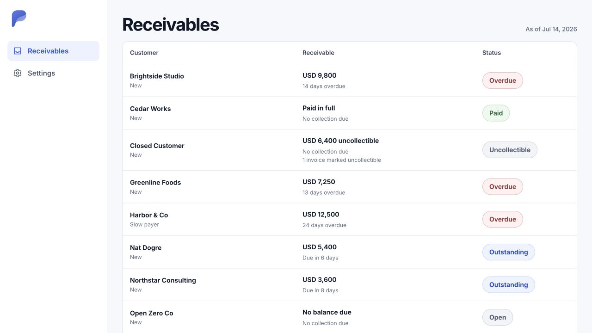
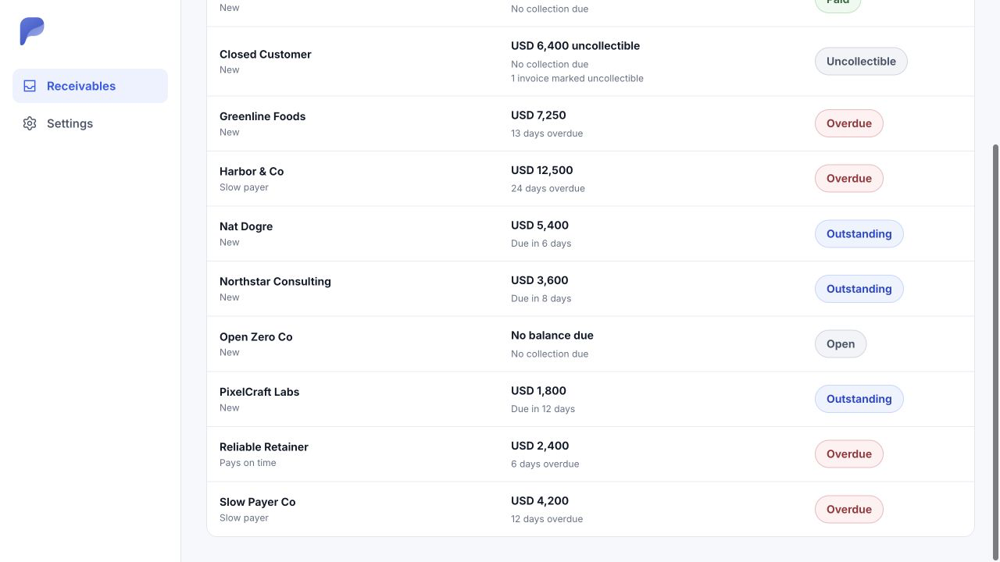
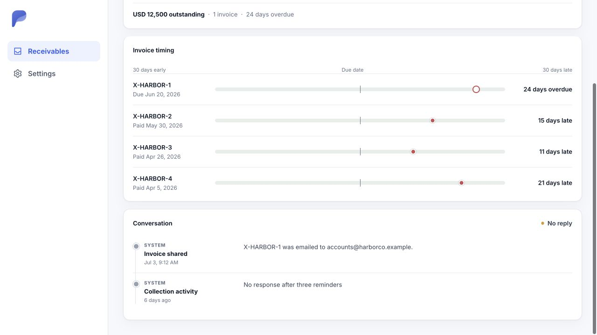
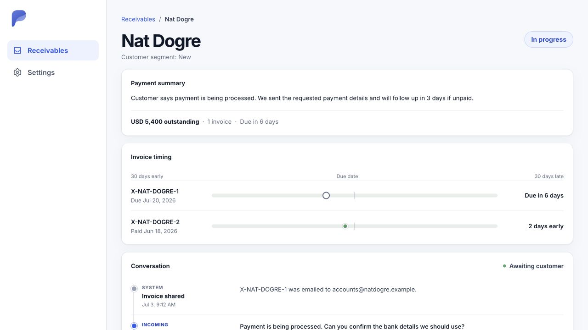
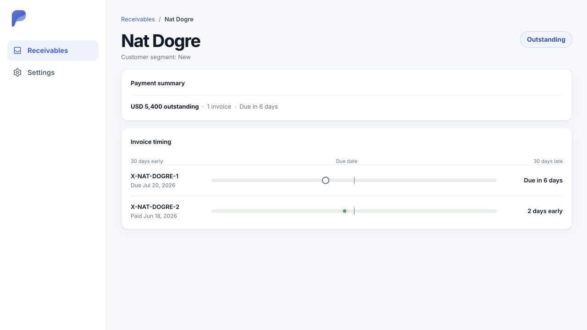

# Invoice UI visual archive

Captured on July 14, 2026 with disposable test-only customer and invoice data.

These screenshots preserve the visual language of the former Receivables
inbox: the bordered table card, customer identity with payer segment, muted
secondary facts, and rounded operational status pills. The current authenticated
screen is the invoice index at `/invoices`; there is no Receivables route or
model.

The active invoice index should show only persisted invoice facts:

- company identity and payer segment;
- amount payable and invoice timing;
- canonical invoice status.

Payer segments remain persisted on customers after a full invoice sync and are
calculated from up to the latest 12 completed outcomes. Paid outcomes require
both due and final payment dates, and uncollectible outcomes count as not paid
on time. Open and overdue invoices are excluded until resolved. Customers with
fewer than three completed outcomes are Normal Debtors.

Do not add reminder, reply, schedule, dispute, or conversation claims until the
corresponding records and workflow exist.

## Former inbox before cleanup

## Persisted-facts visual baseline

## Archived customer-detail reference

There is currently no customer-detail route or screen. These captures are kept
only as visual reference for a future customer-detail feature. The conversation
examples are prototypes and must not return until their data and workflow are
persisted.

